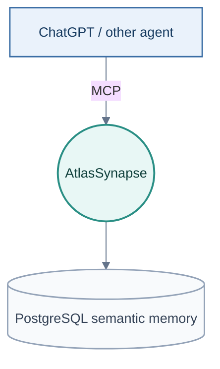
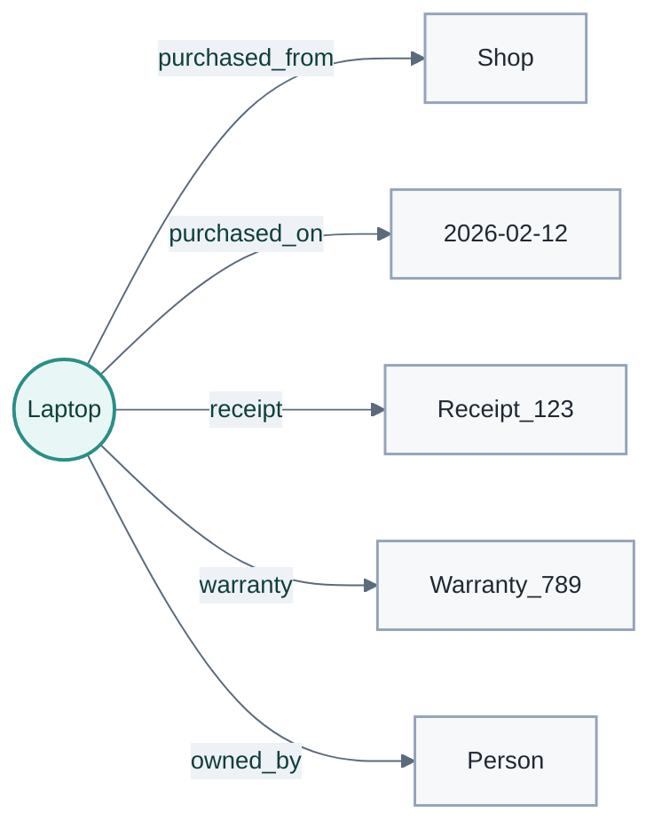
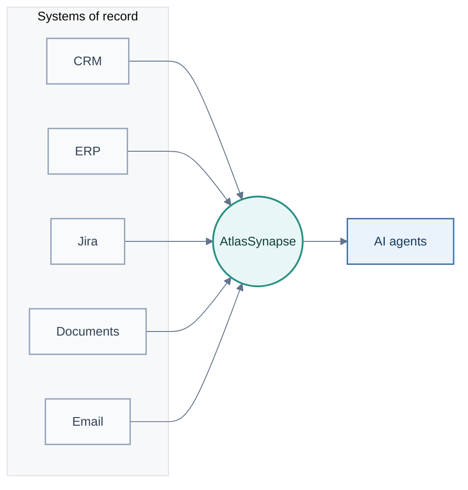
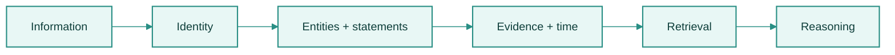
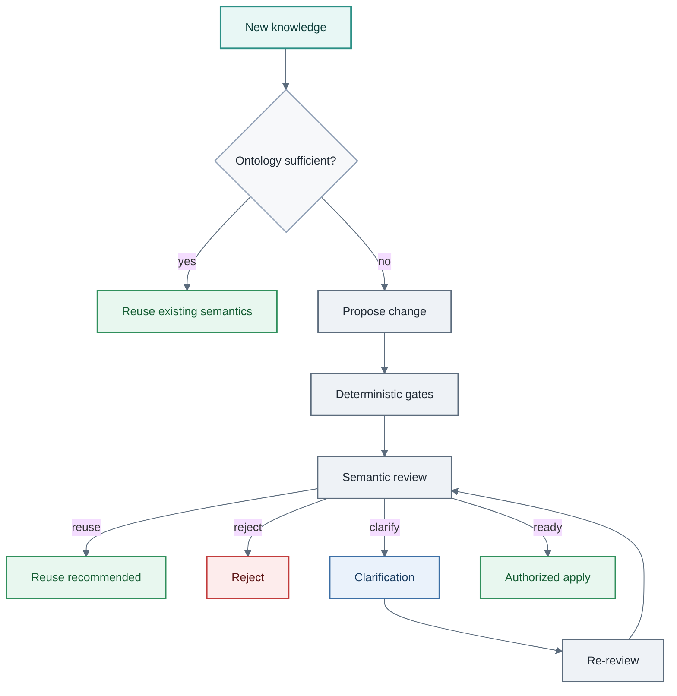
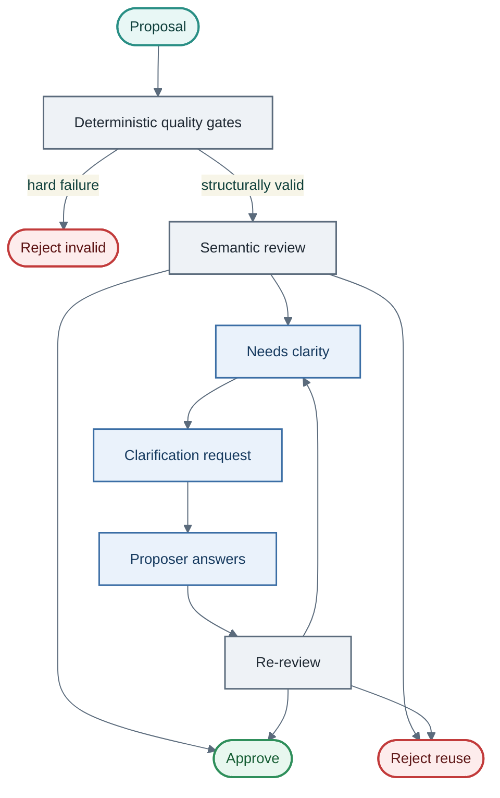
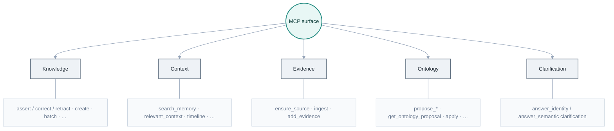

<p align="center">
  
</p>

<p align="center">
  
</p>

<br>

<h2 align="center">
AI can remember text.<br>
AtlasSynapse gives it a world model.
</h2>

<p align="center">
<strong>An open-source reference implementation and working demonstrator of governed semantic memory for AI agents.</strong>
</p>

<p align="center">
  <a href="https://github.com/didac-crst/atlas-synapse/actions/workflows/ci.yml"></a>
  
  
  
  
  <a href="LICENSE"></a>
</p>

<br>

> **Project status:** AtlasSynapse is an actively developed reference implementation
> and working demonstrator, not a production-certified enterprise platform. It is
> currently dogfooded through ChatGPT over MCP and a self-hosted PostgreSQL
> backend. ChatGPT is one agent client; AtlasSynapse itself is independent and
> exposes MCP/API interfaces.



---

## Memory is not the same as knowledge

An assistant can remember:

> The laptop was bought in 2026 and has an extended warranty.

Useful. Eventually you also need:

> Where was it bought? Which receipt proves it? When does the warranty expire?
> Which email changed that date? Which source should we trust?

Those questions are about **entities, relationships, time and evidence** — not
about remembering more text.

AtlasSynapse makes that structure explicit:



Instead of preserving only what was said, AtlasSynapse preserves what exists, how
things relate, when facts were true, and where those facts came from.

## What AtlasSynapse is

AtlasSynapse is an **open-source reference implementation and working demonstrator**
for governed semantic memory in AI-agent systems.

It explores how agents can accumulate structured knowledge, resolve identity,
preserve provenance and history, and participate in semantic-model evolution under
deterministic and LLM-assisted governance — without silently redefining meaning.

Plain text remains excellent for nuance and conversational context. AtlasSynapse
does not replace that memory. It makes selected structure explicit so an agent
can query it, connect it, challenge it, and evolve it under governance.

> **Text preserves meaning. Ontology makes selected meaning explicit.**

## Why AtlasSynapse matters

Most software assumes its domain can be modeled in advance.

A CRM knows customers and opportunities. A ticketing system knows issues. An ERP
knows products and orders. That works when the domain and the questions are known.

AI agents make this problem more acute. They encounter people, projects,
failures, decisions, contracts, experiments, suppliers, requirements, locations,
evidence, and relationships autonomously and at higher frequency — often beyond
what anyone anticipated when the database was designed.

One option is to keep all of that as text. Another is to continuously extend
application schemas. AtlasSynapse takes a third approach:

> **Keep the physical storage model stable while allowing the semantic model to grow.**

Entities, relationships, and facts live on a generic knowledge substrate. New
domain meaning is normally introduced as ontology data, not as new tables.



Source systems remain authoritative for operational data. AtlasSynapse preserves
the meaning that connects information across them.

This architecture can be applied to engineering defect memory, supplier-quality
intelligence, audit evidence graphs, change-impact analysis, organizational
handovers, operational incident memory, and personal administration. The shared
requirement is **long-lived, connected knowledge whose concepts cannot all be
known upfront**.

For the architectural argument, see [Design thesis](docs/design-thesis.md).
For outcomes and when *not* to use it, see [Business value](docs/business-value.md).

## Knowledge writes own identity resolution

An agent should not need a fragile client-side sequence such as:

```text
search for Didac → guess the entity → maybe create one → assert with its ID
```

That creates races and makes every agent invent its own identity policy.

AtlasSynapse owns identity on the write path. An agent can submit:

```text
Didac → employedBy → Airbus
```

using unresolved entity inputs. AtlasSynapse decides independently whether each
side should **MATCH**, **CREATE**, or **CLARIFY**. Supporting names and weak
graph evidence do not silently collapse two identities.

### Clarification is resumable

When identity cannot be resolved safely, the operation does not simply fail.

AtlasSynapse creates a durable control-plane clarification request containing the
frozen operation and candidate identities. The agent or user can later choose an
existing entity, create a new one, or reject the operation.

Before continuing, AtlasSynapse rechecks current production state. If the world
changed while waiting, it clarifies again rather than committing against stale
assumptions. Handles are one-shot and expire.

Clarification state is operational control-plane state — not knowledge and not
provenance.

### Preview the real decision path

Every mutation supports `dry_run=true`.

A dry run is not a separate approximation. AtlasSynapse executes the same
identity, validation, and semantic-review logic inside a database savepoint and
rolls the knowledge mutation back.

An agent can ask what AtlasSynapse would do without creating knowledge merely to
discover the answer. A clarification originating from a dry run can never be
turned into a real write by answering it; persistence always requires an explicit
execute request.

## Knowledge accumulates

Suppose AtlasSynapse learns a monthly price, then an invoice revises it six months
later. The first fact need not be erased: both claims can keep temporal bounds and
supporting evidence.

When two sources disagree, AtlasSynapse can preserve both claims and record a
conflict rather than silently choosing one. An agent can inspect the sources and
resolve the discrepancy.

## Stable physical schema, evolving meaning

A conventional application hard-codes domain concepts into tables and columns.
That is appropriate when the domain is known and stable.

AtlasSynapse is designed for a knowledge model that keeps evolving — including
concepts that were not anticipated when the database was designed.

New classes, predicates, entities, and statements are normally added as **data**,
not by creating new SQL tables. Architecturally:

1. **Stable physical schema** — PostgreSQL tables for entities, statements,
   provenance, and ontology records;
2. **Evolving semantic model** — classes, predicates, and constraints that
   describe what the knowledge means.

> **New meaning should usually create new data, not new database structures.**

## An ontology that can evolve

Routine knowledge writes stay on the knowledge plane: create or resolve entities,
assert facts, attach evidence, supersede outdated statements, detect conflicts —
deterministically and inexpensively.

If an agent encounters a concept the ontology does not yet represent, it proposes
one. Ontology changes pass through quality gates:

1. **Deterministic gates** — existence, aliases, structure, cycles, domain/range;
2. **Semantic review** — optional LLM judgment of meaning, equivalence, and fit;
3. **Clarification / challenge** — when meaning is ambiguous or a negative decision
   can be overturned with new reasoning;
4. **Authorized apply** — only then may an approved proposal mutate the ontology.

`READY_TO_APPLY` means eligible for an apply attempt, not a committed mutation.
Apply revalidates live ontology state. There is no force/skip path.

### The knowledge model can learn too

There are two feedback loops.

The first accumulates knowledge:



The second appears when new knowledge cannot be represented correctly:



An agent should not invent a concept merely because it cannot find one, and it
should not force unfamiliar knowledge into an incorrect existing category.

> **AtlasSynapse governs not only what an agent knows, but how the language it uses to represent knowledge is allowed to evolve.**



## Provenance is part of the knowledge

AtlasSynapse does not only store a warranty expiry date. It can also preserve the
source document, locator, and observation/assertion times — so an agent can answer
both *when* and *why we believe it*.

## Retrieval

Hybrid retrieval v1 combines tokenized lexical matching, temporal/effective-state
ranking, soft predicate intent, and bounded graph anchors. A frozen project gold
set is used for regression testing; the current benchmark reaches **100% Recall@3**
and **~0.99 MRR on that set**.

See [retrieval-hybrid-v1.md](docs/retrieval-hybrid-v1.md).

## Architectural commitments

- **Python + PostgreSQL** at the core (SQLAlchemy, Alembic, Pydantic).
- Thin MCP layer exposing semantic operations (intent-shaped agent surfaces).
- Deterministic routine knowledge writes; governed ontology control plane.
- Server-owned identity, resumable clarification, full-path dry-run.
- Append, supersede, retract, deprecate, and merge — not ordinary destructive mutation.
- Temporal validity, provenance, and evidence as first-class data.
- Explicit ambiguity and conflict handling; idempotent writes.
- No arbitrary SQL or dynamic table creation through MCP.
- Optional vector similarity; embeddings are derived indexes, never authoritative truth.

## MCP surface

Agents interact with semantic operations, not database primitives. The default
ChatGPT catalog (`MCP_TOOL_SURFACE=agent`) is a **12-tool** intent-shaped surface;
`advanced` / `admin` / `all` expand visibility. Surfaces are UX, not authorization.

Grouped by intent (full registry may include more; see the MCP contract):



There are intentionally no tools such as `run_sql`, `create_table`, or `drop_table`.

Authoritative catalogs: [MCP contract](docs/mcp-contract.md) and
[MCP agent surface](docs/mcp-agent-surface.md).

## Documentation

- [Design thesis](docs/design-thesis.md)
- [Business value](docs/business-value.md)
- [Architecture](docs/architecture.md)
- [Ontology model](docs/ontology-model.md)
- [Data model](docs/data-model.md)
- [Invariants](docs/invariants.md)
- [MCP contract](docs/mcp-contract.md)
- [MCP agent surface](docs/mcp-agent-surface.md)
- [Hybrid retrieval v1](docs/retrieval-hybrid-v1.md)
- [Operations](docs/operations.md)
- [Deployment](docs/deployment.md)
- [Error catalog](docs/error-catalog.md)
- [Development roadmap](docs/roadmap.md)

## Local development

```bash
python -m venv .venv
source .venv/bin/activate

make install
make infra-up
make migrate
make test
```

Useful targets: `make lint`, `make format`, `make typecheck`, `make ci`, `make seed`.

```bash
semantic-memory          # HTTP API
semantic-memory-mcp      # MCP stdio
# docker compose up --build
```

Health: `GET /health/live`, `GET /health/ready`.

Non-health HTTP routes accept `Authorization: Bearer <HTTP_API_TOKEN>` or
`X-API-Token` when configured (required in production). See
[deployment.md](docs/deployment.md).

## Project status

AtlasSynapse is actively developed and already supports the complete core
knowledge lifecycle: identity-aware writes, temporal statements, provenance,
conflicts, governed ontology evolution, semantic clarification, retrieval,
dry-run mutation previews, MCP access, operational inspection, and deployment
packaging.

Recent capability milestones (after the original phase roadmap):

- identity-resolution layer with deterministic evidence and bounded LLM adjudication (#11);
- server-owned identity on statement writes; resumable write clarification;
- full-path dry-run mutation previews;
- explicit correction / supersession / retraction envelopes;
- governed ontology apply from MCP; selectable agent MCP surfaces;
- concurrent MCP dispatch and latency diagnosis;
- hybrid retrieval v1 and frozen retrieval regression benchmark (#15).

See the [development roadmap](docs/roadmap.md) for history and next focus.

---

**AtlasSynapse is a reference implementation exploring how AI agents can keep structured, temporal, evidence-backed knowledge — and evolve the semantic model used to represent it — under governance rather than guesswork.**

Licensed under the [Apache License 2.0](LICENSE).
