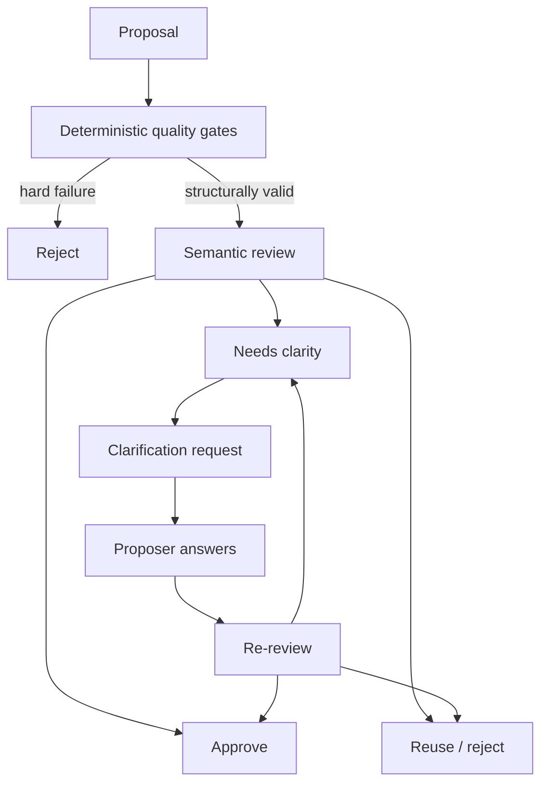

<p align="center">
  
</p>

<p align="center">
  
</p>

**AtlasSynapse gives AI agents structured memory they can reason about, trace, and safely evolve over time.**

Instead of remembering only text, it stores people, projects, events, relationships, dates, evidence and provenance as explicit knowledge.

When the knowledge model itself needs to evolve, AtlasSynapse uses deterministic quality gates first, bounded LLM semantic review second, and clarification when the meaning is ambiguous.

## Your life already has a data model. It is just scattered everywhere.

Imagine using an AI assistant for the boring parts of everyday life.

You send it a receipt for a new laptop.

A few months later, you upload the warranty.

Later still, there is an email confirming that the manufacturer extended the warranty by another year.

The laptop also appears on an invoice from the shop, a bank transaction, and perhaps eventually in an insurance claim.

Each individual piece of information is easy to understand.

The useful part is everything connecting them:

```text
Laptop
 ├── purchased_from → Shop
 ├── purchased_on → 2026-02-12
 ├── purchase_price → €1,499
 ├── receipt → Receipt_123
 ├── payment → Transaction_456
 ├── warranty → Warranty_789
 └── owned_by → Person
```

Now imagine the same thing happening across years of:

- receipts and invoices;
- taxes and reimbursements;
- insurance policies;
- subscriptions and contracts;
- warranties;
- vehicles and travel bookings;
- administrative deadlines.

An AI agent can remember useful information about all of this.

But memory is often deliberately compact: important details are summarized into text so they remain useful within a limited context.

That is very different from preserving the underlying structure.

Eventually, questions appear such as:

> Do I still have proof of purchase for the washing machine?
>
> When does its warranty expire?
>
> Which invoice corresponds to this bank payment?
>
> Which active contracts have a cancellation deadline in the next three months?
>
> Why do we believe this subscription costs €29.99 rather than €24.99?

At that point, remembering more text is not quite enough.

The problem has become one of **connected facts, time, evidence and constraints**.

That is what AtlasSynapse is for.

## What AtlasSynapse is

AtlasSynapse is a **self-hosted structured knowledge and memory layer for AI agents**.

It stores knowledge as explicit things, relationships, events, dates, evidence and provenance — not only textual summaries.

Plain text is wonderfully expressive, but much of its structure remains implicit. An ontology makes selected parts of that structure explicit: what something is, how it relates to other things, when a fact is valid, and why we believe it.

A conventional memory might preserve:

> The washing machine was bought in 2025 and has an extended warranty.

AtlasSynapse can preserve the structure behind that statement:

```text
WashingMachine_1 → type → Appliance

Purchase_42:
    item → WashingMachine_1
    seller → Retailer_8
    date → 2025-06-14
    amount → €649
    evidence → Receipt_192

Warranty_17:
    covers → WashingMachine_1
    provider → Manufacturer_3
    valid_from → 2025-06-14
    valid_to → 2028-06-14
    evidence → WarrantyDocument_51
```

The distinction matters.

The information can now be queried independently, connected to new information later, and traced back to its source.

### Why not just store text?

Plain text is excellent at preserving nuance, context and explanation — preferences, habits, and compact conversational context.

AtlasSynapse does not try to replace that memory.

But text often leaves important structure implicit.

For example:

```text
Alice became Product Manager at Airbus in 2018.
```

A human immediately understands:

```text
Alice             → Person
Product Manager   → Role
Airbus            → Organization

Alice             → holdsRole → Product Manager
Product Manager   → roleAt    → Airbus
valid_from        → 2018
```

Making that structure explicit changes what an agent can reliably do with the information.

It can query it, combine it with other facts, apply temporal reasoning, detect conflicts, preserve provenance, and reuse the same concepts across different domains.

> **Text preserves meaning. Ontology makes selected meaning explicit.**

## Knowledge accumulates

The interesting part is what happens over time.

Suppose AtlasSynapse initially learns:

```text
InternetContract
    monthly_price → €39.99
```

Six months later an invoice says:

```text
monthly_price → €44.99
```

AtlasSynapse does not need to erase the first fact.

It can preserve:

```text
€39.99
valid_until → 2026-05-31

€44.99
valid_from → 2026-06-01
```

with the invoice supporting each statement.

Or perhaps two documents disagree about the cancellation notice:

```text
Contract → cancellation_notice → 30 days
FAQ      → cancellation_notice → 60 days
```

Instead of silently choosing one, AtlasSynapse can preserve both claims and record that they conflict.

An agent can then inspect the sources and resolve the discrepancy.

## The same model works beyond administration

AtlasSynapse does not have a predefined `receipt` database, a `tax` database and a `warranty` database.

Those are semantic concepts in one shared model:

```text
Class       What kinds of things exist
Predicate   How those things can be described or connected
Entity      A concrete thing
Statement   A claim about that thing
Source      Why that claim exists
```

From here the README becomes more technical. The value proposition above is the whole pitch; what follows is how the system is engineered.

The same substrate can represent people, companies, projects, documents, equipment, contracts, experiments, decisions, expenses, properties, events, and places — because domain meaning lives above the storage layer, not inside a growing set of specialty tables.

## Stable physical schema, evolving meaning

A conventional application often hard-codes domain concepts into tables and columns: `persons`, `projects`, `warranties`, `insurance_claims`, and the join tables that connect them.

That approach is appropriate when the domain is known and stable.

AtlasSynapse is designed for a knowledge model that keeps evolving — including concepts that were not anticipated when the database was designed.

In AtlasSynapse, new classes, predicates, entities, and statements are normally added as **data**, not by creating new SQL tables, columns, or join tables.

So a relationship such as:

```text
Laptop → insuredBy → InsurancePolicy_17
```

should not require an `ALTER TABLE` or a new application model. If `insuredBy` or `InsurancePolicy` is missing, that is an ontology/data question — not a storage redesign.

Architecturally, AtlasSynapse separates:

1. **Stable physical schema** — PostgreSQL tables for entities, statements, provenance, and ontology records;
2. **Evolving semantic model** — classes, predicates, and constraints that describe what the knowledge means.

The ontology evolves above the storage substrate. Ordinary semantic expansion should not require a migration.

> **New meaning should usually create new data, not new database structures.**

When an agent needs a concept that does not exist yet, it proposes one. Quality gates and semantic review decide whether to accept it. If accepted, the ontology evolves — still without changing the core PostgreSQL schema.

## An ontology that can evolve

Nobody can realistically design every concept a personal knowledge system may need in advance.

Today it may need:

```text
Receipt
Warranty
Subscription
```

Tomorrow:

```text
TaxDeductibleExpense
InsuranceClaim
CancellationWindow
```

That is why AtlasSynapse separates routine knowledge writes from governed ontology change.

### Knowledge plane

Routine operations are deterministic and inexpensive:

- create or resolve an entity;
- assert a fact;
- connect two entities;
- attach evidence;
- record an event;
- supersede an outdated statement;
- preserve history;
- detect conflicts.

No LLM call is required simply to remember that an invoice cost €129.

### Ontology control plane

If an agent encounters a concept the ontology does not yet represent, it can propose one.

For example:

```text
CancellationWindow
```

Ontology changes pass through a sequence of **quality gates**:

1. **Deterministic gates** — existence, aliases, structural validity, cycles, domain/range compatibility, and related hard rules;
2. **Semantic review gate** — optional LLM judgment of meaning, equivalence, and modeling fit;
3. **Clarification / challenge loop** — when meaning is ambiguous or a negative decision can be overturned with new reasoning;
4. **Authorized apply** — only then may an approved proposal mutate the ontology.

AtlasSynapse can let an LLM review ontology changes, but only inside that deterministic quality-gate system — with clarification, challenge, provenance, cost tracking, and safe fallback.

Accepted proposals add meaning as ontology data. The core physical schema stays put.

> **Meaning evolves as data.**

### How ontology changes are reviewed

Routine knowledge does not need an LLM.

If AtlasSynapse learns:

```text
Laptop → purchase_price → €1,499
```

that is a normal deterministic write.

Changing the ontology is different.

Suppose an agent proposes a new concept:

```text
JobTitle
```

AtlasSynapse first runs deterministic quality gates:

```text
Does the key already exist?
Does an alias already represent it?
Is the proposed structure valid?
Would it create an invalid cycle?
Are its domain and range compatible?
```

If one of those hard rules fails, the proposal stops there.

The LLM cannot override them.

If the proposal is structurally valid but its meaning is uncertain, AtlasSynapse can ask a semantic reviewer.

For example:

```text
Proposed: JobTitle
Existing: Role
```

The reviewer may conclude:

```text
reuse Role
```

because the new concept would not add meaningful semantics.

But another proposal may genuinely be unclear:

```text
Proposed: CapabilityArea
Existing: Skill
```

Instead of guessing, AtlasSynapse can return a clarification request:

> How does CapabilityArea differ from Skill?
>
> Give an example that belongs to CapabilityArea but should not be represented as a Skill.

The requesting agent answers that specific question using a clarification ID created by AtlasSynapse.

For example:

```text
CapabilityArea is a domain grouping such as Data Engineering.
Skill is a concrete competence such as SQL optimisation.
```

AtlasSynapse then performs another semantic review using the additional explanation.

The result may become:

```text
approve
```

The same mechanism allows a negative semantic decision to be challenged when the proposer has new reasoning or evidence.

The important distinction is:

```text
deterministic rules decide what is structurally allowed
LLM review helps judge meaning
AtlasSynapse owns the lifecycle and identifiers
```

The LLM cannot directly modify the ontology.

Every review is recorded with its model decision, confidence, selected context, token usage, cost and review lineage.

If the reviewer is unavailable, uncertain, or lacks enough context, AtlasSynapse falls back to manual review rather than silently approving the change.



## Provenance is part of the knowledge

AtlasSynapse does not only store:

```text
Warranty expires → 2028-06-14
```

It can also preserve:

```text
source → warranty.pdf
page → 2
observed_at → ...
asserted_at → ...
```

That means an agent can answer both:

> When does the warranty expire?

and:

> Where did that information come from?

Those are very different guarantees.

## Architectural commitments

- **Python + PostgreSQL** at the core.
- SQLAlchemy, Alembic and Pydantic for persistence and contracts.
- A thin MCP layer exposing semantic operations.
- Deterministic routine knowledge writes.
- A governed ontology control plane.
- Append, supersede, retract, deprecate and merge instead of ordinary destructive mutation.
- Temporal validity as first-class data.
- Provenance and evidence as first-class data.
- Explicit ambiguity and conflict handling.
- Idempotent writes so retries remain safe.
- No arbitrary SQL or dynamic table creation through MCP.
- Optional vector similarity support; `pgvector` is not required.
- Embeddings are derived indexes, never authoritative knowledge.

## MCP surface

Agents interact with semantic operations rather than database primitives.

Examples:

```text
create_entity
assert_statement
assert_batch
supersede_statement
add_evidence
merge_entity

get_entity
search_entities
get_entity_neighborhood
get_timeline
explain_statement
find_conflicts

get_class
get_predicate
search_ontology

propose_class
propose_predicate
propose_constraint
```

There are intentionally no tools such as:

```text
run_sql
create_table
drop_table
```

The agent works with meaning.

AtlasSynapse owns storage integrity.

## Documentation

- [Architecture](docs/architecture.md)
- [Ontology model](docs/ontology-model.md)
- [Invariants](docs/invariants.md)
- [MCP contract](docs/mcp-contract.md)
- [Operations](docs/operations.md)
- [Deployment](docs/deployment.md)
- [Error catalog](docs/error-catalog.md)
- [Development roadmap](docs/roadmap.md)
- [Cursor implementation guide](docs/cursor-implementation.md)
- [Architecture decision records](docs/adr/)

## Local development

```bash
python -m venv .venv
source .venv/bin/activate

make install
make infra-up
make migrate
make test
```

Useful targets:

```bash
make lint
make format
make typecheck
make ci
make seed
```

Start the HTTP API:

```bash
semantic-memory
# or full stack:
# docker compose up --build
```

MCP stdio transport:

```bash
semantic-memory-mcp
```

Health endpoints:

```text
GET /health/live
GET /health/ready
```

Non-health HTTP routes accept `Authorization: Bearer <HTTP_API_TOKEN>` or `X-API-Token` when that token is configured (required in production). See [deployment.md](docs/deployment.md).

## Project status

Phases 0–15b are implemented: the core substrate is in place (knowledge plane, provenance, conflicts, ontology governance, retrieval, LLM observability, production packaging, agent feedback, and admin inspection).

The next focus is **Phase 15+** after dogfooding: ingestion policy, optional inspection UI, and advanced semantic capabilities informed by observed failure modes.

Already delivered includes:

- PostgreSQL schema, migrations, ontology bootstrap, health checks, and CI;
- actors, entities, statements, temporal validity, provenance, and idempotent `operation_log` auditing;
- conflicts, batch ingestion, ontology read plane, and governed ontology proposals with deterministic quality gates, production LLM semantic review, clarification/challenge workflows, and auditable review lineage;
- database-backed retrieval with transparent ranking signals and `llm_call_log` observability;
- Docker/Compose packaging, HTTP API authentication, MCP stdio transport, and deployment docs;
- `agent_feedback` reporting (`report_feedback`) with fingerprint dedupe and admin resolve;
- read-only `/v1/admin/*` inspection APIs and cross-domain operational summaries.

See the [development roadmap](docs/roadmap.md) for the full sequence.

---

**AtlasSynapse gives AI agents a structured place to put the details that are too granular, connected, temporal, or evidence-dependent to live comfortably inside ordinary conversational memory.**
