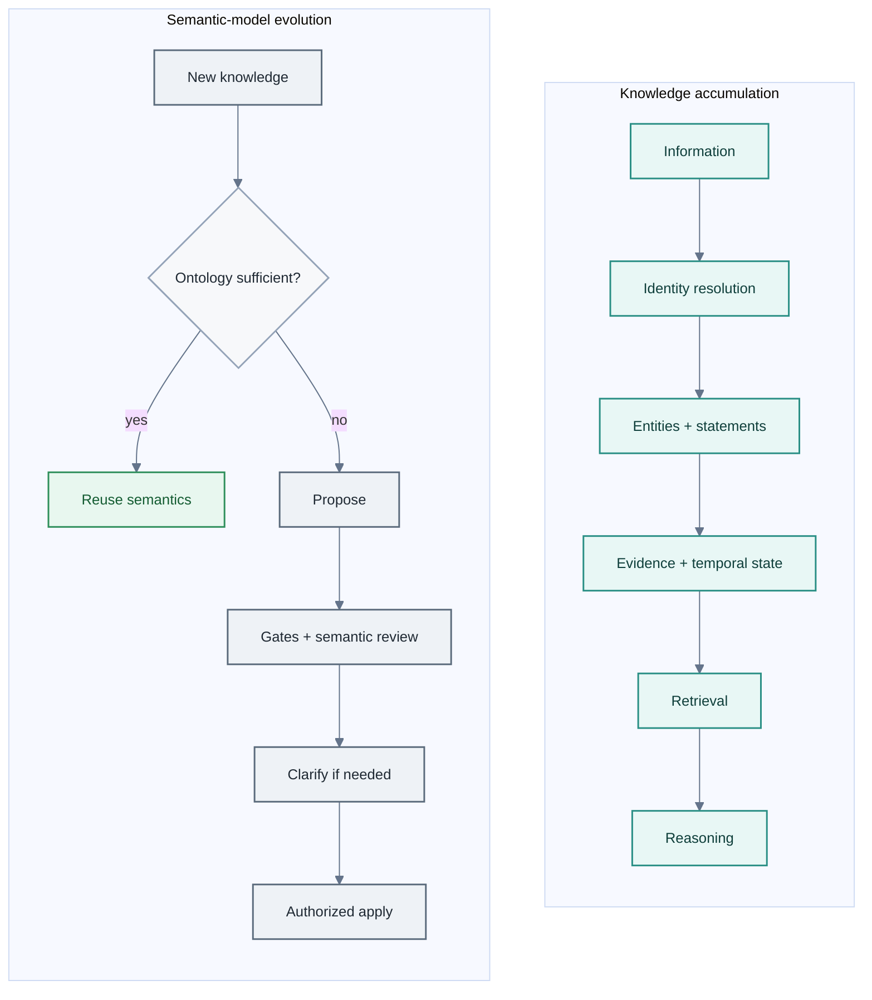

# AtlasSynapse architecture

## Purpose

AtlasSynapse is a self-hosted **governed semantic-memory layer** for AI agents.

Agents accumulate open-ended structured knowledge (entities, relationships, time,
evidence). When the existing semantic model is insufficient, they may participate
in evolving that model — but AtlasSynapse independently governs identity, reuse,
structural validity, semantic review, clarification, and application.

The database is a stable physical substrate. Semantic concepts are data in the
ontology tables; new concepts must not create SQL tables or execute DDL through MCP.

For the architectural argument, see [design-thesis.md](design-thesis.md).

## Technology baseline

Python 3.12+, PostgreSQL, SQLAlchemy, Alembic, Pydantic, and FastAPI-style service
boundaries. The MCP adapter remains thin and typed. LLM/provider integrations are
replaceable. `pgvector` is optional; core correctness does not depend on embeddings.

## Logical planes

### Knowledge plane

High-volume deterministic operations:

- entity creation and reuse;
- server-owned identity resolution on writes (MATCH / CREATE / CLARIFY);
- statement assertion, correction, supersession, and retraction;
- evidence and sources;
- temporal history;
- explicit entity merges;
- hybrid retrieval (lexical, temporal, predicate intent, bounded anchors).

Routine knowledge writes do not require an LLM.

### Ontology control plane

Low-volume governed operations:

- classes, predicates, constraints, aliases, and inheritance;
- proposals with deterministic structural, cycle, domain, range, and revision gates;
- optional semantic reuse / overlap review;
- clarification and challenge;
- authorized apply with live revalidation (`ontology.apply`).

External agents create proposals. Applying an ontology change is a separate,
capability-gated commit — proposal ≠ mutation.

### Clarification as operational state

Identity (and some ontology) ambiguity creates durable **control-plane** handles
(`write_clarification_request` and ontology clarification requests).

**Clarification state is operational/control-plane state, not knowledge and not
provenance.** It stores a frozen mutation (or review question), candidates, expiry,
and one-shot resolution metadata so a later answer can resume safely after
rechecking current production state.

### Full-path dry-run

`dry_run=true` executes the same identity, validation, and semantic-review path
inside a database savepoint and rolls knowledge mutations back. It is not a
separate approximate validator. Clarification handles created from dry-run remain
dry-run on answer; production persistence requires an explicit execute request.
See [operations.md](operations.md) and [invariants.md](invariants.md).

## Two feedback loops



MCP tool surfaces (`agent` / `advanced` / `admin` / `all`) are **visibility UX**,
not authorization. Capability checks, review gates, idempotency, and audit still
apply. See [mcp-agent-surface.md](mcp-agent-surface.md).

## Boundary rules

- MCP translates typed requests and responses; it does not contain business logic.
- Services implement semantic rules and transaction boundaries.
- Repositories perform persistence and query composition.
- ORM models describe persistence and avoid business logic.
- Validation is explicit and reusable.
- Domain exceptions are translated into stable transport errors.
- Every mutation is attributable to an actor and request ID.
- Every mutating operation requires an idempotency key.

## Package layout

```text
src/semantic_memory/
├── config.py
├── db.py
├── models/
├── schemas/
├── repositories/
├── services/
├── validation/
├── mcp/
├── api/
└── observability/
```

[cursor-implementation.md](cursor-implementation.md) is the **historical** original
implementation blueprint. Current guidance is this document, the README, the
roadmap, and the MCP contract.

## Data domains

The physical schema is divided into Ontology, Knowledge, Provenance, Governance,
Operations (including write clarification), Reasoning, and optional derived
embeddings. Table inventory: [data-model.md](data-model.md). Semantic contract:
[ontology-model.md](ontology-model.md).

## Transaction principles

Write services define explicit transaction boundaries for identity resolution plus
creation, duplicate detection plus assertion, supersession, entity merge, ontology
application, clarification resume, and idempotency processing. Idempotency
reservation and operation execution must be coordinated so retries cannot
double-write. Dry-run uses a rolled-back savepoint for knowledge writes.

## Readiness

`/health/live` checks process liveness. `/health/ready` checks database
connectivity and migration compatibility. External semantic review availability is
not a knowledge-plane readiness dependency.

## Explicit non-goals for v1

No RDF store, OWL reasoner, SPARQL endpoint, autonomous entity merging,
probabilistic truth engine, UI, graph database migration, required vector
dependency, dynamic SQL schema creation, distributed event bus, or multi-node
clustering.

## Related documents

- [Design thesis](design-thesis.md)
- [MCP contract](mcp-contract.md)
- [Hybrid retrieval v1](retrieval-hybrid-v1.md)
- [Invariants](invariants.md)
