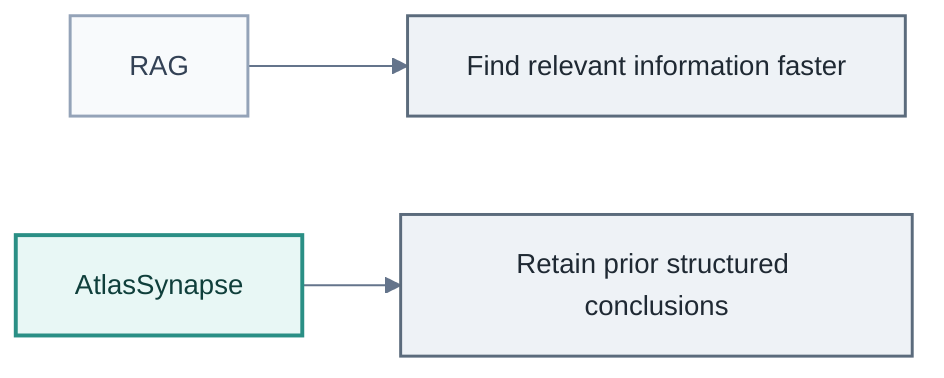
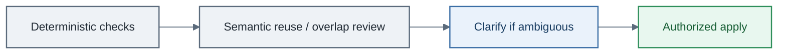

# Business value

AtlasSynapse is worthwhile when an organization repeatedly pays the cost of
**reconstructing context** that should have remained structured, connected, and
attributable.

> **AtlasSynapse targets the hidden tax of context reconstruction.**

The architectural thesis is in [design-thesis.md](design-thesis.md). This document
answers a different question:

> Why should a company care — and where does this save money, reduce risk, or
> improve decisions?

This is a business-case note, not a claim of measured enterprise savings. Candidate
KPIs are listed so value can be tested; they are not reported results.

## The economic problem

Organizations rarely lose knowledge because the source data disappeared. They lose
it because the relationships, conclusions, context, and evidence connecting that
data were never preserved in reusable form.

Source systems still hold tickets, orders, emails, and documents. The hidden costs
appear elsewhere:

- people repeatedly reconstruct the same context from scratch;
- agents repeatedly re-read and reinterpret the same material;
- prior investigations are hard to discover under different wording;
- decisions lose their rationale after the meeting or author leaves;
- organizational change destroys informal mental models;
- cross-system dependencies stay invisible until something fails.

AtlasSynapse does not replace CRM, ERP, or ticketing. It reduces the hidden tax of
reconnecting them every time a hard question returns.

## Value model

AtlasSynapse creates value when:

```text
frequency of repeated reasoning
× cost of reconstruction
× importance of relationships / history / evidence
```

is high.

It is least valuable where questions are simple, one-off, or adequately answered
from a single source. It becomes more valuable as knowledge is reused, evolves
over time, and crosses system boundaries.

### Four value mechanisms

| Mechanism | What improves |
| --- | --- |
| **Reduce labor / cycle time** | Avoid repeating investigations; faster onboarding and audits |
| **Reduce operational risk** | Fewer identity mistakes, missed dependencies, unsupported decisions |
| **Improve decision quality** | Historical evidence and prior reasoning remain available |
| **Increase AI productivity** | Agents accumulate reusable understanding instead of reconstructing context every session |

## Search / RAG vs structured semantic memory

RAG can reduce search time. AtlasSynapse targets a different cost: repeatedly
reconstructing identity, temporal state, relationships, provenance, and prior
conclusions from retrieved text.



If the pain is “find the right paragraph,” search or RAG is usually enough.
AtlasSynapse becomes relevant when the pain is “decide what is true, about what,
with what evidence, across changing concepts.”

## Governed semantic evolution as an operating-cost lever

Many enterprise systems either rely on relatively fixed schemas, or they allow the
model to evolve through explicit human-controlled design and review. That
governance is valuable, but it can become a bottleneck when AI agents encounter
new concepts continuously.

AtlasSynapse **prototypes** a different model: deterministic rules first, bounded
LLM semantic review second, and human clarification only where the system cannot
resolve ambiguity safely.

Traditional systems usually treat schema evolution as a design-time activity: a
human decides that a new object, relationship, or field is needed, reviews the
change, and applies it. AtlasSynapse explores whether part of that
semantic-evolution workflow can move closer to runtime without giving up
governance.

The intended order is:



The LLM is not the authority. It is a bounded semantic reviewer inside a
deterministic control system.

The distinction is not “humans bad, AI automatic good.” It is: keep the quality
gate, move the easy and repeatable parts of the gate into software, and reserve
human attention for genuine semantic ambiguity.

In conventional ontology or schema governance, every semantic extension may
require expert intervention. AtlasSynapse is exploring whether organizations can
preserve that governance while reducing the amount of human attention required for
routine semantic evolution.

## Flagship use cases

Each case follows the same chain: business pain → current failure mode → what
AtlasSynapse changes → measurable outcome. Measures are candidates for evaluation,
not claimed savings.

### 1. Engineering / defect memory

**Business pain.** Similar defects recur across programs, but prior root-cause
work is hard to find and reuse.

**Failure mode.** A new investigation starts from scratch because past work lives
across tickets, reports, emails, and individual engineers — often under different
wording for the same mechanism.

**AtlasSynapse.** Connects defect → component → symptom → failure mechanism →
investigation → evidence → corrective action → later recurrence, with identity
and provenance preserved.

**Business outcome.** Shorter investigation cycle time, fewer repeated analyses,
faster recognition of known failure mechanisms.

**Candidate measures.** Investigation lead time; % of investigations reusing prior
evidence; duplicated investigations avoided; time to identify a known root cause.

### 2. Change-impact analysis

**Business pain.** Dependency knowledge is spread across systems; teams miss
affected components, requirements, or customers.

**Failure mode.** Impact review depends on tribal memory and ad-hoc document
search. Cross-system links surface only after a change escapes.

**AtlasSynapse.** Makes affected entities and relationships queryable as an
explicit graph with temporal and evidence context.

**Business outcome.** Earlier impact discovery, fewer downstream surprises, better
change reviews.

**Candidate measures.** Change-review escapes; time spent gathering impact
context; % of relevant dependents surfaced before release.

### 3. Corporate / decision memory

**Business pain.** “Why did we decide this?” disappears after the author or
meeting context is gone.

**Failure mode.** Staff turnover and reorgs force repeated debate and architecture
archaeology from slides, chat, and tickets.

**AtlasSynapse.** Retains decision entities with rationale, alternatives
considered, linked evidence, and later supersession.

**Business outcome.** Lower handover and onboarding cost; less repeated debate;
faster recovery of prior reasoning.

**Candidate measures.** Onboarding time to productive context; % of decisions with
traceable rationale; time spent reconstructing “why.”

### 4. Compliance / audit evidence

**Business pain.** Evidence assembly is manual and repetitive whenever an audit
or claim review returns.

**Failure mode.** Claims are rebuilt by hunting across systems for documents,
dates, and owners that were already found last time.

**AtlasSynapse.** Links claims to evidence, sources, actors, and validity windows
so the assembly path is reusable.

**Business outcome.** Faster audits; traceable claims; less evidence-reconstruction
effort.

**Candidate measures.** Audit preparation hours; time to produce an evidence pack;
% of claims with complete provenance links.

### 5. Incident / operations memory

**Business pain.** Recurring incidents are often treated as new ones.

**Failure mode.** Operators re-diagnose familiar symptoms because prior
mitigations and root causes are not connected under shared identity.

**AtlasSynapse.** Links incident → symptoms → affected assets → prior mitigations
→ evidence → recurrence, with temporal state.

**Business outcome.** Lower MTTR; faster similarity detection; reuse of prior
mitigation.

**Candidate measures.** MTTR; time to match a known incident class; repeated
incident rate for known mechanisms.

### 6. Cross-system customer intelligence

**Business pain.** CRM holds commercial state, but not the technical and
operational reasons behind escalation, churn risk, or renewal friction.

**Failure mode.** Account decisions are made from opportunity stage and notes
while defect, incident, and delivery history stay siloed.

**AtlasSynapse.** Connects customer / account entities to technical history,
incidents, commitments, and evidence across systems of record.

**Business outcome.** Better renewal, escalation, and account decisions grounded
in linked operational context.

**Candidate measures.** Time to assemble account technical context; % of
escalations with linked prior history; context-gathering effort before renewals.

## Candidate KPIs (evaluation, not claims)

Use these to test fit in a pilot. Do not treat them as validated AtlasSynapse
results:

- investigation cycle time;
- MTTR;
- onboarding time to productive context;
- audit preparation hours;
- repeated-analysis / duplicated-investigation rate;
- % of decisions with traceable rationale;
- % of relevant past cases surfaced;
- change-review escapes;
- time spent gathering context before a decision;
- LLM / token / context-reconstruction cost per investigation.

## Conditions for ROI

AtlasSynapse is most likely to pay off when:

- investigations or hard questions recur;
- knowledge crosses multiple systems;
- the same entities appear under different names;
- facts change over time and history matters;
- evidence and provenance affect risk or compliance;
- prior reasoning should influence future reasoning;
- knowledge outlives the person or session that produced it;
- agents must write durable structure, not only summarize text.

## When AtlasSynapse is not worth it

Do **not** introduce it for:

- a simple FAQ or help-center search problem;
- generic document retrieval where passages are enough;
- stable relational workflows whose schema already covers the domain;
- one-off analysis that will not be reused;
- situations where relationships, history, and provenance do not affect
  decisions or risk;
- questions that are mostly one-shot and answered from a single authoritative
  database;
- domains where ordinary search already solves the problem and shallow
  relationships are enough.

If reconstruction is rare, cheap, or unnecessary, the complexity of governed
semantic memory will not justify itself.

## Positioning summary

| Buyer question | Short answer |
| --- | --- |
| Where is the money? | Avoided reconstruction labor and shorter cycles on recurring hard questions |
| Where is the risk? | Identity mistakes, missed impacts, unsupported claims, lost rationale |
| Where is the AI leverage? | Agents retain structured conclusions instead of paying reconstruction every session |
| What must stay true? | Systems of record remain authoritative; AtlasSynapse holds cross-cutting meaning |

AtlasSynapse sits beside systems of record. Its business case is the reduction of
the hidden tax of context reconstruction — for people and for AI agents —
without abandoning governance of identity, evidence, and semantic evolution.
