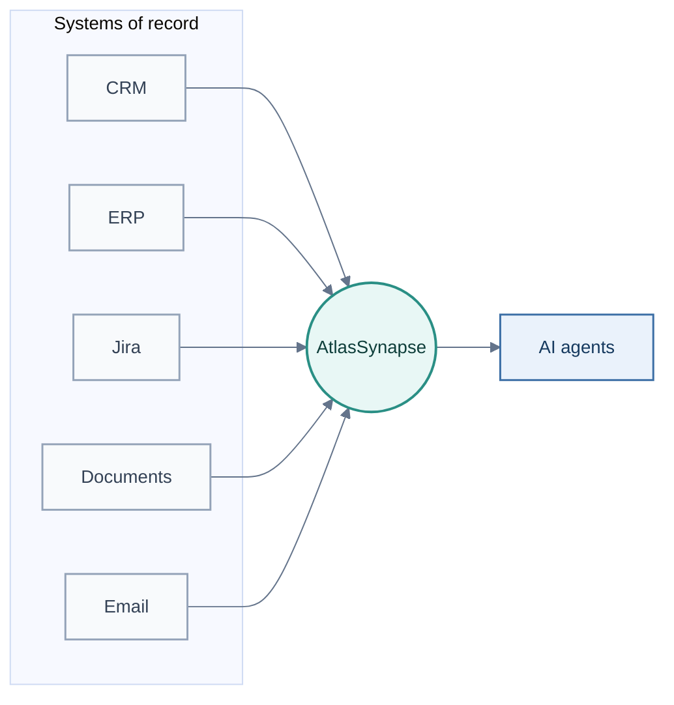
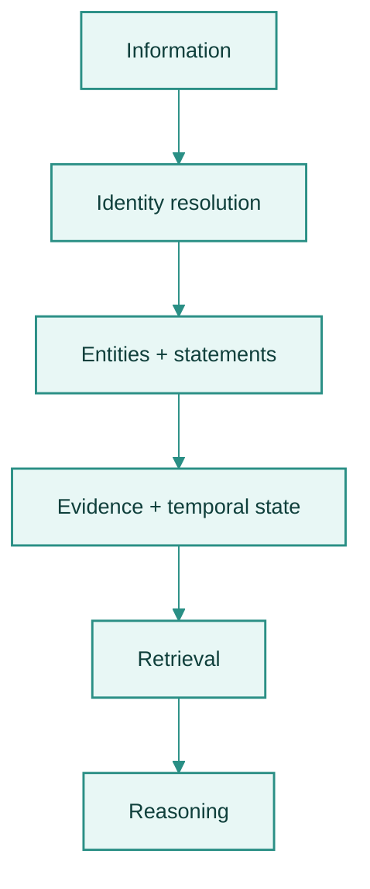
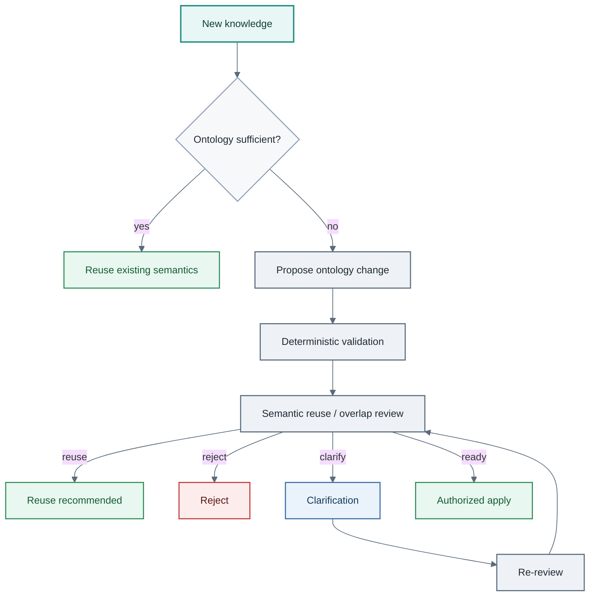

# Design thesis

AtlasSynapse is a governed semantic-memory layer for AI agents.

The short form of the thesis:

> AI agents need persistent structured knowledge across domains, but the concepts
> they will encounter cannot all be designed upfront. AtlasSynapse separates a
> stable knowledge substrate from an evolving semantic model, while governing
> identity, evidence, ambiguity, and changes to that model.

The differentiator underneath it:

> The agent can discover that its current semantic model is insufficient, but it
> cannot silently redefine that model.

## Why fixed schemas are insufficient

Most software assumes its domain can be modeled in advance.

A CRM knows customers, contacts, and opportunities. A ticketing system knows
issues and workflows. An ERP knows products, orders, and transactions.

That works when the domain and the questions are known.

AI agents make this problem more acute. They encounter and attempt to
operationalize changing knowledge autonomously and at higher frequency — people,
projects, failures, decisions, contracts, experiments, suppliers, requirements,
locations, evidence, commitments, and relationships that nobody anticipated when
the database was designed.

Continuously extending application schemas for every newly discovered semantic
concept becomes increasingly costly when the domain is open-ended and
cross-cutting. It couples storage migrations to semantic discovery and forces
every agent to wait on schema ownership.

## Why raw text memory is insufficient

Text preserves nuance well. It is a poor substrate for:

- identity (“which Didac?”);
- temporal truth (“what was true then vs now?”);
- evidence (“where did that claim come from?”);
- conflict (“two sources disagree”);
- reuse across domains (“the same Person in warranty, employment, and incident”).

A vector index over text can retrieve similar passages. It does not decide whether
two mentions are the same entity, whether a fact was superseded, or whether a new
label is a synonym of an existing predicate.

AtlasSynapse does not replace conversational memory. It makes selected meaning
explicit so agents can query, connect, challenge, and evolve it.

## Stable physical schema, evolving semantic model

AtlasSynapse keeps the **physical storage model** stable while allowing the
**semantic model** to grow.

Entities, relationships, and facts live on a generic knowledge substrate
(PostgreSQL tables for entities, statements, provenance, ontology records).

New domain meaning is normally introduced as **ontology data** — classes,
predicates, constraints, aliases — not as new application tables.

> Keep the physical storage model stable while allowing the semantic model to grow.

Ordinary semantic expansion should create new data, not new database structures.

## Complements systems of record

Source systems remain authoritative for operational data. AtlasSynapse preserves
the meaning that connects information across them:

This architecture can be applied to engineering defect memory, supplier-quality
intelligence, audit evidence graphs, change-impact analysis, organizational
handovers, and personal administration. The shared requirement is long-lived,
connected knowledge whose concepts cannot all be known upfront.

## Server-owned identity

Agents should not each invent their own fragile resolve-then-assert sequence.
That creates races and inconsistent identity policies.

AtlasSynapse owns identity on the write path. An agent may submit unresolved
entity inputs; the service decides MATCH, CREATE, or CLARIFY independently for
each side. Weak evidence does not silently collapse two identities.

## Uncertainty becomes clarification

When identity or ontology meaning cannot be resolved safely, AtlasSynapse does
not guess.

It creates a durable **control-plane** clarification handle: frozen operation,
candidates, expiry, one-shot resolution. Answering that handle rechecks current
production state before continuing. If the world changed while waiting, AtlasSynapse
clarifies again rather than committing against stale assumptions.

Clarification state is operational control-plane state. It is not knowledge and
not provenance.

## Ontology proposal is not ontology mutation

Agents may propose how the semantic model should evolve. AtlasSynapse still owns:

- deterministic structural gates;
- semantic reuse / overlap review;
- clarification and challenge;
- authorization (`ontology.apply`);
- revalidation against live ontology state at apply time.

`READY_TO_APPLY` means eligible for an apply attempt, not a committed mutation.
There is no force/skip path around gates.

## Two feedback loops

### Knowledge accumulation

### Semantic-model evolution

An agent should not create a new concept merely because it cannot find one, and
it should not silently force unfamiliar knowledge into an incorrect existing
category. Semantic-model gaps are governed decisions.

> AtlasSynapse governs not only what an agent knows, but how the language it uses
> to represent knowledge is allowed to evolve.

## Related documents

- [Business value](business-value.md)
- [Architecture](architecture.md)
- [Ontology model](ontology-model.md)
- [MCP contract](mcp-contract.md)
- [Invariants](invariants.md)
